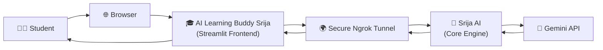
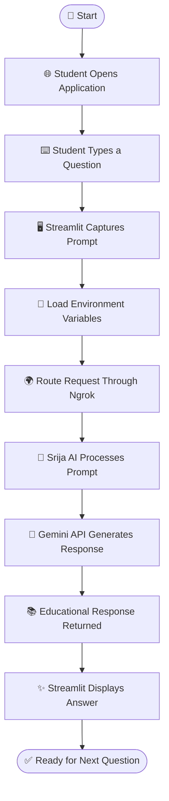
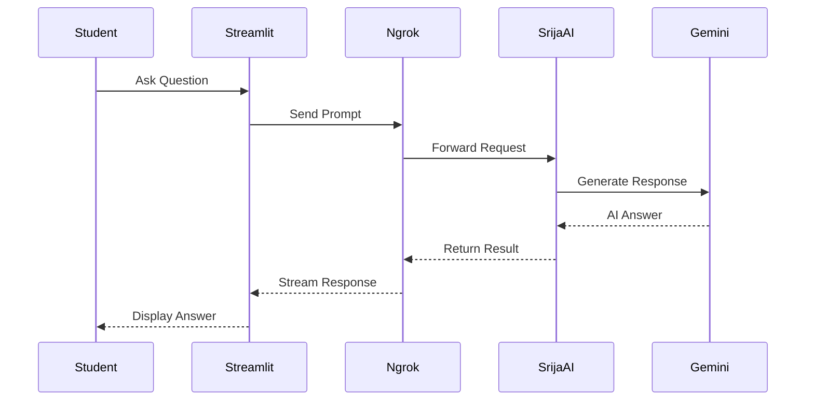
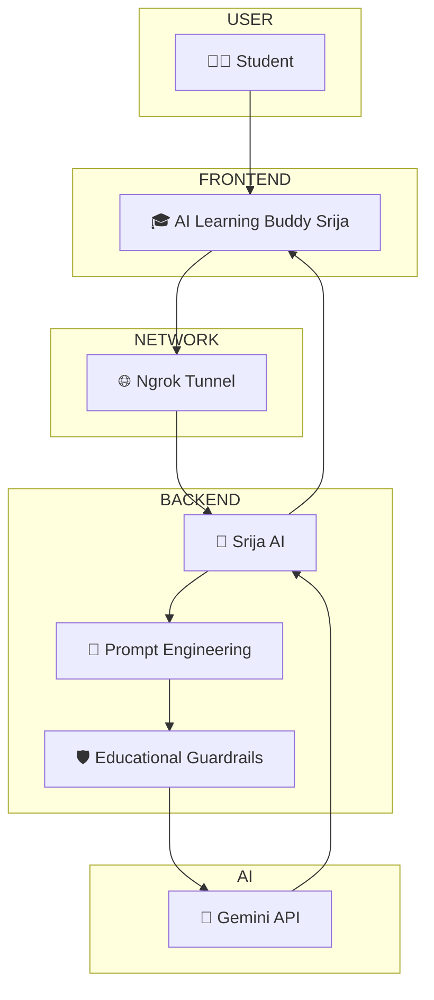
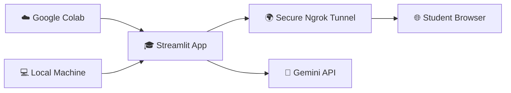
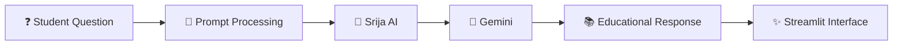

# 🎓 AI Learning Buddy Srija

<div align="center">

### 🤖 *An Interactive AI-Powered Learning Assistant for Students*

Built using **Python**, **Streamlit**, **Gemini API**, and **Ngrok** to provide an intelligent educational experience through a clean and responsive web interface.

<br>


</div>

---

# 📖 Overview

**AI Learning Buddy Srija** is an AI-powered educational assistant designed to help students learn interactively through natural language conversations.

The application is built using **Streamlit** as the frontend interface while a dedicated backend workspace (**Srija AI**) manages prompt engineering, educational guardrails, and AI response generation.

The project can be executed either:

* 💻 Locally using Streamlit
* ☁️ Through Google Colab
* 🌍 Publicly via a secure Ngrok Tunnel

---

# 🏗️ System Architecture



---

# 🏷️ Naming Architecture

To maintain a clean separation between the presentation layer and backend logic, two different system names are intentionally used.

| Layer       | Name                        | Purpose                                                |
| ----------- | --------------------------- | ------------------------------------------------------ |
| 🎨 Frontend | **AI Learning Buddy Srija** | Student-facing Streamlit application                   |
| ⚙ Backend   | **Srija AI**                | Core AI workspace, prompt engineering and system logic |

---

# 🔄 Complete Application Workflow



---

# ⚡ Request Lifecycle



---

# 🧩 Component Architecture



---

# ☁️ Deployment Architecture



---

# 📂 Project Structure

```text
AI-Learning-Buddy-Srija
│
├── app.py
├── requirements.txt
├── README.md
├── .env
│
├── assets/
│   ├── banner.png
│   ├── architecture.png
│   └── workflow.png
│
└── notebooks/
    └── AI_Learning_Buddy.ipynb
```

---

# ✨ Key Features

* 🎓 Interactive AI-powered educational assistant
* 🤖 Customized prompt engineering for student learning
* ⚡ Real-time AI-generated responses
* 🌐 Secure public deployment using Ngrok
* 🖥 Clean and responsive Streamlit interface
* 🔐 Secure API key management using `.env`
* ☁️ Google Colab compatible
* 💻 Local execution support

---

# 🛠️ Technology Stack

| Technology    | Purpose                      |
| ------------- | ---------------------------- |
| Python        | Application Development      |
| Streamlit     | Frontend Web Interface       |
| Gemini API    | AI Response Generation       |
| Python Dotenv | Secure Environment Variables |
| Ngrok         | Public Tunnel                |
| Google Colab  | Cloud Development            |

---

# 🚀 Running the Project

## ☁️ Option 1 — Google Colab (Recommended)

1. Open the provided notebook in Google Colab.
2. Add your Gemini API Key.
3. Add your Ngrok Authentication Token.
4. Run all notebook cells.
5. The notebook automatically:

   * launches the Streamlit application
   * creates a secure Ngrok tunnel
   * generates a public URL
6. Open the generated URL in your browser.

---

## 💻 Option 2 — Run Locally

### Step 1

Create a `.env` file

```env
API_KEY=YOUR_API_KEY
```

---

### Step 2

Install dependencies

```bash
pip install streamlit python-dotenv pyngrok
```

---

### Step 3

Run the application

```bash
streamlit run app.py
```

---

# 📌 Execution Pipeline



---

# 📊 System Flow Summary

```text
Student
   │
   ▼
AI Learning Buddy Srija
(Streamlit)

   │

   ▼
Ngrok Tunnel

   │

   ▼
Srija AI Core

   │

   ▼
Gemini API

   │

   ▼
Educational Response

   │

   ▼
Student Interface
```

---

# 👩‍💻 Project Submission

| Item           | Details                     |
| -------------- | --------------------------- |
| Student Name   | **Srija Bhattacharya**      |
| Program        | **AI Empower(H)er Program** |
| Application    | **AI Learning Buddy Srija** |
| Backend Engine | **Srija AI**                |

---

# 💡 Future Enhancements

* 📄 PDF generation
* 🎤 Voice-based interaction
* 🌐 Multi-language support
* 📊 Learning progress analytics
* 📝 Personalized quizzes
* 📚 Learning history
* 🎓 Adaptive learning recommendations

---

# ❤️ Acknowledgements

Special thanks to:

* 💙 **Skillsoft**
* 💙 **Infosys Springboard**
* 💙 **AI Empower(H)er Program**
* 💙 **Dr. Pallavi Khanna**

for providing an incredible opportunity to explore Generative AI and build meaningful AI-powered educational solutions.

---

<div align="center">

## ⭐ If you found this project interesting, don't forget to star the repository!

**Made with ❤️ by Srija Bhattacharya**

</div>
