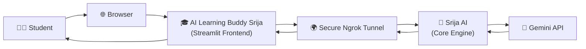
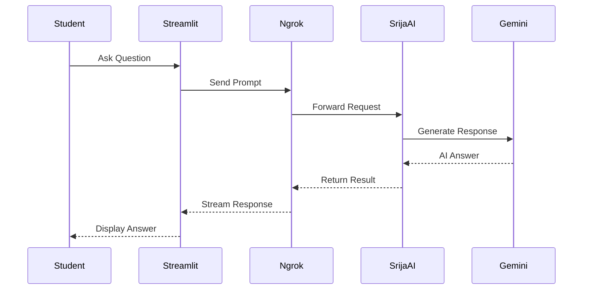
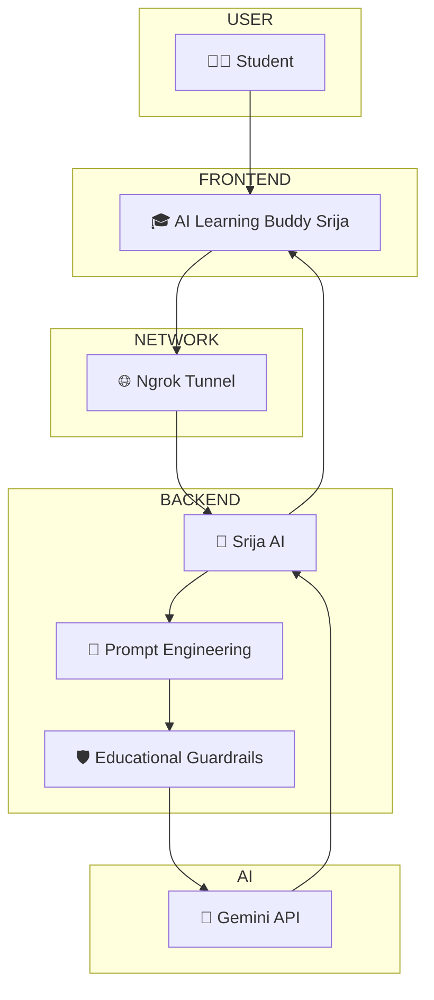
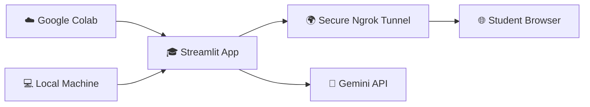
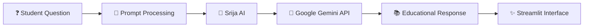

<div align="center">

###  *An Interactive AI-Powered Stock Market Investing Tutor for Beginners* 🤖

> Learn the fundamentals of stock market investing through interactive AI-powered conversations. 📈🤖

Built using **Python**, **Streamlit**, **Google Gemini API**, **Google Colab**, **ngrok**, and **GitHub** to provide an intelligent learning experience through a clean and responsive web interface.

<p align="center">
</p>


<br>


</div>

---

##  Overview 📖

**AI Learning Buddy Srija** is an AI-powered educational assistant designed to make **Stock Market Investing** easy to understand for beginners.

The application serves as the user-facing **Streamlit** interface, while **Srija AI** acts as the internal AI engine responsible for prompt engineering, educational guardrails, and response orchestration using the **Google Gemini API**.

It helps learners understand investing concepts through simple explanations, real-life examples, interactive quizzes, and personalized question-answering, making financial education more engaging and accessible for beginners.

Built with **Python**, **Streamlit**, and the **Google Gemini API**, the application combines an intuitive web interface with carefully designed prompts to deliver beginner-friendly, interactive, and educational learning experiences.


The project can be executed using:

- 💻 Streamlit (Local)
- ☁️ Google Colab
- 🌍 Secure ngrok Tunnel

---

## 📸 Preview

| Explain Concept Page | Real- Life Learning Mode |
|-----------|---------------|


</p>

| Quiz | Ask Anything |
|------|--------------|


</p>

---

## System Architecture 🏗️



---

##  Naming Architecture 🏷️

To maintain a clean separation between the presentation layer and backend logic, two different system names are intentionally used.

| Layer       | Name                        | Purpose                                                |
| ----------- | --------------------------- | ------------------------------------------------------ |
| 🎨 Frontend       | AI Learning Buddy Srija | User-facing Streamlit application                                                             |
| 🧠 AI Logic Layer | Srija AI                | Prompt engineering, educational guardrails, tutoring logic, and response orchestration |
| 🤖 AI Model       | Google Gemini API       | Generates AI-powered responses                                                         |


---

##  Complete Application Workflow 🔄


---

##  Request Lifecycle ⚡



---

##  Component Architecture 🧩



---

##  Deployment Architecture ☁️



---

---

## 📂 Project Structure

```text
AI-Learning-Buddy-Srija/
│
├── app.py                      # Main Streamlit application
├── requirements.txt            # Project dependencies
├── README.md                   # Project documentation
├── .gitignore                  # Git ignore rules
├── .env.example                # Environment variable template
│
├── notebooks/
│   └── AI_Learning_Buddy.ipynb # Google Colab notebook
│
└── assets/
    ├── banner.png              # Project banner
    └── screenshots/            # Application screenshots
```

---

## ✨ Key Features

- 📈 Beginner-friendly AI tutor for **Stock Market Investing**
- 🤖 AI-powered explanations using **Google Gemini 2.5 Flash**
- 🌍 Real-life examples to simplify complex investing concepts
- 📝 Automatic 5-question MCQ quiz generation with answers
- 💬 "Ask Anything" mode for personalized learning
- ⚡ Instant AI-generated responses
- 🌐 Public deployment using **ngrok**
- 🔐 Secure API key management with environment variables
- ☁️ Compatible with **Google Colab** and local execution
- 📱 Clean, responsive, and user-friendly Streamlit interface

---

## 📚 Learning Modes

Students can choose from four different learning modes depending on how they want to learn.

| Learning Mode | Description |
| :--- | :--- |
| 📖 Explain Concept | Explains stock market concepts in simple, beginner-friendly language. |
| 🌍 Real-Life Example | Uses everyday examples and analogies to improve understanding. |
| 📝 Generate Quiz | Creates five multiple-choice questions with correct answers. |
| 💬 Ask Anything | Allows learners to ask any stock market or investing-related question. |

---

## 🛠️ Technology Stack

| Technology | Purpose |
| :--- | :--- |
| Python | Core application development |
| Streamlit | Interactive web interface |
| Google Gemini API | AI-powered response generation |
| Google Colab | Cloud-based development environment |
| ngrok | Public deployment and secure tunneling |
| python-dotenv | Secure environment variable management |
| GitHub | Version control and project hosting |

---

## 🚀 Running the Project

## ☁️ Option 1 — Google Colab (Recommended)

1. Open the notebook in **Google Colab**.
2. Add your **Google Gemini API Key**.
3. Add your **ngrok Authentication Token**.
4. Run all notebook cells.
5. The notebook will:
   - Launch the Streamlit application
   - Create a secure ngrok tunnel
   - Generate a public URL
6. Open the generated URL in your browser.

---

## 💻 Option 2 — Run Locally

### Step 1 — Create a `.env` file

```env
GEMINI_API_KEY=YOUR_API_KEY
NGROK_AUTH_TOKEN=YOUR_NGROK_TOKEN
```

### Step 2 — Install dependencies

```bash
pip install -r requirements.txt
```

### Step 3 — Launch the application

```bash
streamlit run app.py
```
## 🌐 Live Demo

🚀 **Try the application here:**

https://ai-learning-buddy-srija.streamlit.app/

## 📌 Execution Pipeline



---

## 📊 System Flow Summary

```text
Student
   │
   ▼
AI Learning Buddy Srija
(Streamlit)

   │
   ▼
ngrok Tunnel

   │
   ▼
Prompt Processing

   │
   ▼
Google Gemini API

   │
   ▼
AI Response

   │
   ▼
Student Interface
```

---

## 👩‍💻 Project Information

| Field | Details |
| :--- | :--- |
| Developer | **Srija Bhattacharya** |
| Project | **AI Learning Buddy Srija** |
| Domain | **Stock Market Investing** |
| AI Model | **Google Gemini 2.5 Flash** |
| Program | **AI Empower(H)er Program** |

---

## 💡 Future Enhancements

- 📊 Interactive stock market charts
- 🎤 Voice-enabled AI tutoring
- 🌐 Multi-language support
- 📈 Personalized learning recommendations
- 📝 Adaptive quizzes based on learner performance
- 📄 Export notes and quizzes as PDF
- 🏆 Student learning progress dashboard

---
---

## ❤️ Acknowledgements


This project was developed as part of the **AI Empower(H)er Program**.

Special thanks to:

- 💙 Dr. Pallavi Khanna Ma'am
- 💙 Infosys Springboard
- 💙 Skillsoft

for creating a platform where learners from every background can explore Generative AI, build real-world projects, and gain hands-on experience through the AI Empower(H)er Program.

## ⭐ Support

If you enjoyed exploring this project or found it useful, consider giving it a ⭐ on GitHub. 
It helps support the project and encourages future improvements.


## 📄 License

This project is intended for educational purposes as part of the AI Empower(H)er Program.


<p align="center">
Made with ❤️ by <b>Srija Bhattacharya</b>
</p>

</div>
