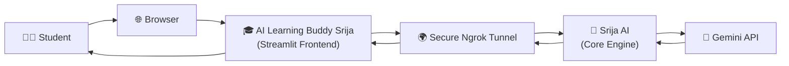
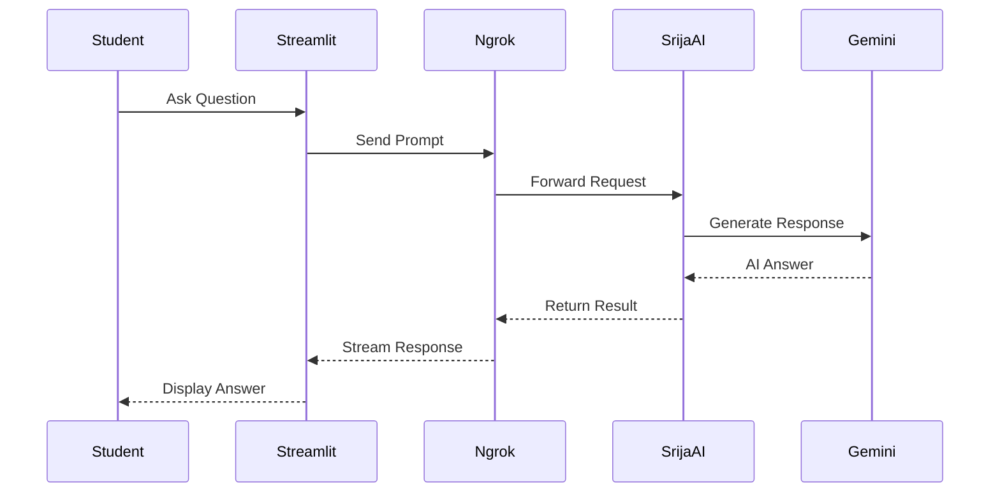
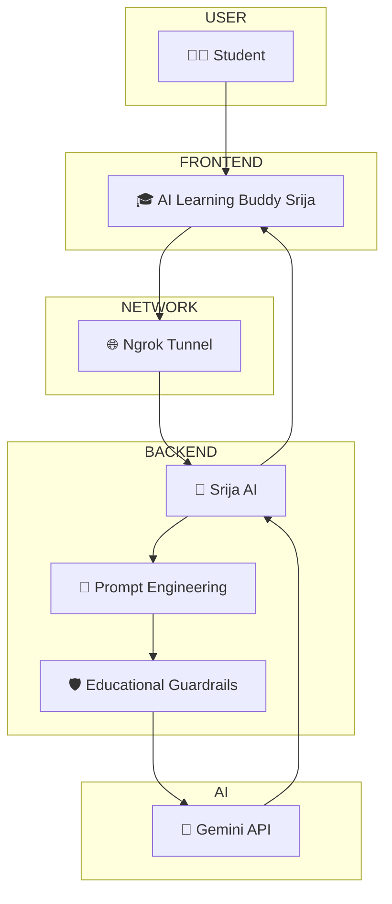
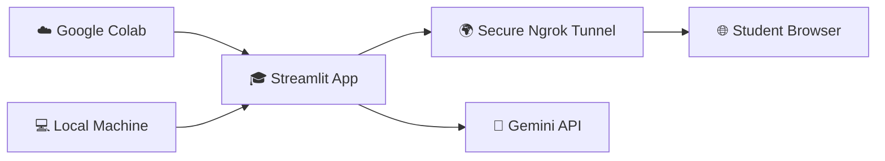
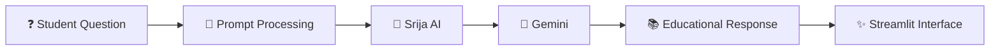

<div align="center">

###  *An Interactive AI-Powered Stock Market Investing Tutor for Beginners* 🤖

Built using **Python**, **Streamlit**, **Google Gemini API**, **Google Colab**, **ngrok**, and **GitHub** to provide an intelligent learning experience through a clean and responsive web interface.
<br>


</div>

---

##  Overview 📖

**AI Learning Buddy Srija** is an AI-powered educational assistant designed to make **Stock Market Investing** easy to understand for beginners.

The application explains investing concepts in simple language, provides real-life examples, generates quizzes, and answers students' questions interactively.

Built using **Streamlit** and powered by the **Google Gemini API**, the application uses carefully designed prompts to produce beginner-friendly, engaging, and educational responses.

The project can be executed using:

- 💻 Streamlit (Local)
- ☁️ Google Colab
- 🌍 Secure ngrok Tunnel

---

## System Architecture 🏗️



---

##  Naming Architecture 🏷️

To maintain a clean separation between the presentation layer and backend logic, two different system names are intentionally used.

| Layer       | Name                        | Purpose                                                |
| ----------- | --------------------------- | ------------------------------------------------------ |
| 🎨 Frontend | **AI Learning Buddy Srija** | Interactive Streamlit application for learners |
| ⚙ AI Engine | **Google Gemini API**         | Generates educational responses |
| 🧠 Prompt Layer | **Custom Prompt Engineering** | Ensures beginner-friendly and structured explanations |

---

##  Complete Application Workflow 🔄


---

##  Request Lifecycle ⚡



---

##  Component Architecture 🧩



---

##  Deployment Architecture ☁️



---

##  Project Structure 📂

AI-Learning-Buddy-Srija
│
├── app.py
├── requirements.txt
├── README.md
├── .gitignore
├── .env.example
│
├── notebooks/
│   └── AI_Learning_Buddy.ipynb
│
└── assets/
    ├── banner.png
    └── screenshots/
```

---

##  Key Features ✨

- 📈 Beginner-friendly Stock Market Investing tutor
- 🤖 AI-powered explanations using Google Gemini
- 🌍 Real-life examples and easy-to-understand analogies
- 📝 Automatic MCQ quiz generation
- 💬 Ask Anything mode for personalized learning
- ⚡ Real-time AI responses
- 🌐 Secure deployment using ngrok
- 🔐 Secure API key management
- ☁️ Google Colab compatible
- 💻 Local execution support
- 📱 Clean and responsive Streamlit interface

---

##  Learning Modes 📚

Students can choose from four different learning modes.

| Mode | Description |
|------|-------------|
| 📖 Explain Concept | Explains stock market concepts in beginner-friendly language |
| 🌍 Real-Life Example | Connects concepts with practical everyday examples |
| 📝 Generate Quiz | Creates multiple-choice quizzes with answers |
| 💬 Ask Anything | Allows students to ask any investing-related question |

---

##  Technology Stack 🛠️

| Technology    | Purpose                      |
| ------------- | ---------------------------- |
| Python         | Core application development |
| Streamlit      | Interactive web interface |
| Google Gemini API | AI response generation |
| Google Colab | Cloud development |
| ngrok | Public deployment |
| python-dotenv | Secure environment variables |
| GitHub | Version control |

---

##  Running the Project  🚀

##  Option 1 — Google Colab (Recommended) ☁️

1. Open the provided notebook in Google Colab.
2. Add your Gemini API Key.
3. Add your Ngrok Authentication Token.
4. Run all notebook cells.
5. The notebook automatically:

   * launches the Streamlit application
   * creates a secure Ngrok tunnel
   * generates a public URL
6. Open the generated URL in your browser.

---

###  Option 2 — Run Locally 💻

### Step 1

Create a `.env` file

```GEMINI_API_KEY=YOUR_API_KEY
NGROK_AUTH_TOKEN=YOUR_NGROK_TOKEN
```

---

### Step 2

Install dependencies

```bash
pip install -r requirements.txt
```

---

### Step 3

Run the application

```bash
streamlit run app.py
```

---

##  Execution Pipeline 📌



---

##  System Flow Summary 📊

```text
Student
   │
   ▼
AI Learning Buddy Srija
(Streamlit)

   │

   ▼
Ngrok Tunnel

   │

   ▼
Srija AI Core

   │

   ▼
Gemini API

   │

   ▼
Educational Response

   │

   ▼
Student Interface
```

---

##  Project Information 👩‍💻

| Field          | Details                     |
| -------------- | --------------------------- |
| Developer | **Srija Bhattacharya** |
| Project | **AI Learning Buddy Srija** |
| Domain | **Stock Market Investing** |
| AI Model | **Google Gemini 2.5 Flash** |
| Program | **AI EMPOWER(H)ER Program** |
---

##  Future Enhancements 💡

- 📊 Interactive stock charts
- 🎤 Voice-enabled tutoring
- 🌍 Multi-language support
- 📝 Adaptive quizzes based on learner performance
- 📈 Personalized learning roadmap
- 📄 Export notes and quizzes as PDF
- 🏆 Student progress dashboard

---

#  Acknowledgements ❤️

This project was developed as part of the **AI EMPOWER(H)ER Program**.

A heartfelt thank you to:

- 💙 Dr. Pallavi Khanna
- 💙 Infosys Springboard
- 💙 Skillsoft

for creating an inspiring platform where learners from all backgrounds can explore Generative AI, build real-world projects, and grow through hands-on learning.

---

<div align="center">

##  Support ⭐

If you found this project useful or interesting, consider giving it a ⭐ on GitHub!


**Made with ❤️ by Srija Bhattacharya**

</div>
